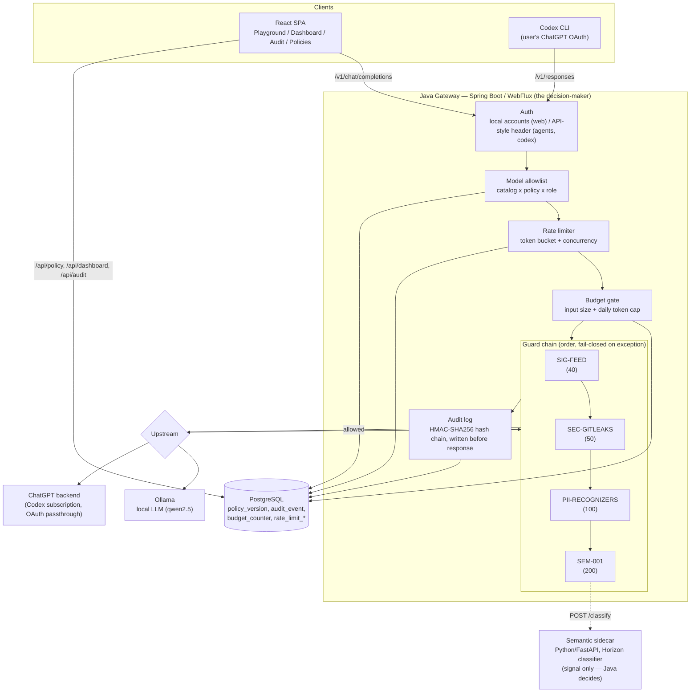

# 2. Architecture

## Diagram

- **Java owns orchestration, policy and the final decision.** The semantic sidecar is an
  interchangeable provider behind a plain HTTP interface (`POST /classify`) — it returns a
  calibrated risk **score**, never a decision.
- **Two upstreams, one pipeline.** Ollama (local, self-hosted) and ChatGPT via Codex CLI
  (subscription OAuth, no API key) go through the exact same guard chain, budgets, rate limiter
  and audit log — see `5-implementation/` for how the Codex adapter works.
- **Policy hot-reload.** `PolicySource`/`PolicyStore` hand every component one `ActivePolicy`
  snapshot per request; the guard chain is rebuilt only when the policy version/hash actually
  changes and cached between requests otherwise.

## Performance: deterministic vs non-deterministic enforcement

Every guard records its **own** execution time (not a pipeline timestamp), so the cost of the
control layer itself can be told apart from upstream model latency (`VISION.md` §4). Below is a
real trace captured from the deployed instance (`/playground`, PESEL block — see
`3-reporting/screenshots/playground-block-pesel.jpg`):

| Check | Kind | Latency |
|---|---|---|
| `model.allowlist` | deterministic (gate) | 22 µs |
| `SEC-GITLEAKS` | deterministic | 45 µs |
| `budget.daily_cap` | deterministic (gate) | 224 µs |
| `PII-RECOGNIZERS` | deterministic | 541 µs |
| `rate.requests` | deterministic (gate) | 34 ms* |
| **Total guard-layer overhead** | | **~41 ms (incl. first-request JIT/DB warmup)** |

*\*Rate-limit/budget gates touch Postgres (atomic row reservation); deterministic content guards
(regex/checksum engines, in-memory) are consistently sub-millisecond.*

**Semantic guard (non-deterministic, Horizon `prompt-injection-guard-small`, ModernBERT-small,
141M params)** — measured in `semantic-sidecar/docs/models.md`:

| Metric | Value |
|---|---|
| Detector latency p50 / p95 (CPU, short text) | **14–16 ms / 23 ms** |
| AUROC (own 122-case eval set) | 0.983 |
| Recall @ FPR ≤ 1% | 82.6% |
| FPR on hard negatives (NotInject, 339 cases) | 10.0% |
| Peak process RSS | 0.84 GB |

**Takeaway:** deterministic checks cost microseconds-to-low-milliseconds (dominated by the DB
round-trip for budget/rate state, not computation); the semantic check costs **one to two orders
of magnitude more** (~15–95 ms depending on model/load) because it's a real forward pass through a
transformer. This is why semantics runs *last* in the chain (order 200) — cheap, high-confidence
deterministic rules reject or redact first, so the expensive classifier only runs on what's left.
End-to-end request latency (dashboard p50/p95, 7-day window: **7.4 s / 32.4 s**) is dominated by
the *protected model's own* generation time, not the control layer — visible separately in the
trace's `latency.totalMs` vs `latency.upstreamMs` vs per-guard timings.

## Caching and correctness

Guard verdicts for identical `(policy hash, stage, message text)` are cached for 30 minutes
(`GuardResultCache`) so a client resending its own conversation history isn't re-scored every
turn. Guards with state that can change **independently of the policy** (e.g. `SIG-FEED`'s
file-based hot reload) opt out via `Guard.cacheable() == false`, so a feed edit is still visible
on the very next request even if the exact same text was seen before — this exact interaction was
caught and fixed via the Cucumber suite (`4-testing/`).
