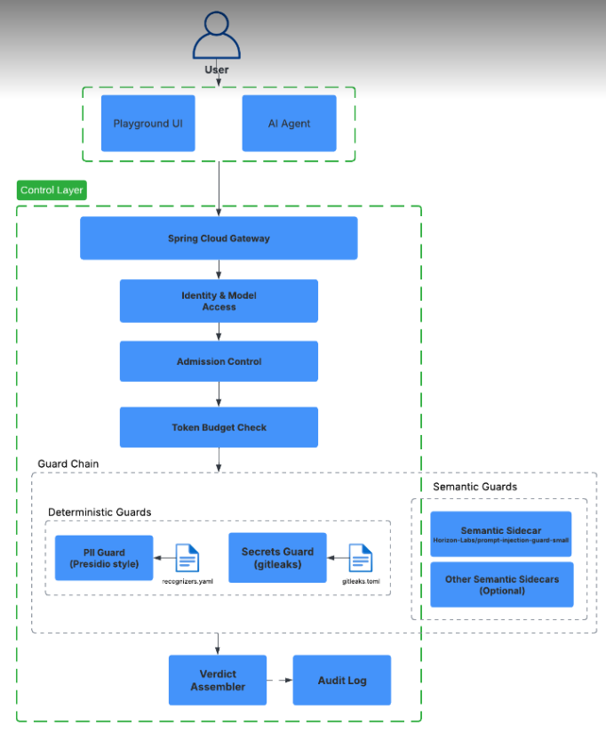

# 2. Architecture

## Diagram

## Walkthrough

Every request — from the **Playground UI** (web chat) or an **AI Agent** (Codex CLI, or any
other client speaking the gateway's API) — goes through the same pipeline, top to bottom:

1. **Spring Cloud Gateway** — the single entry point (Java/WebFlux). No request reaches a
   protected model except through this path.
2. **Identity & Model Access** — the caller is authenticated (local account for the web UI,
   gateway credential for agents), then checked against the **model allowlist**: the model must
   be in the deployment catalog *and* enabled by the active policy *and* listed for the caller's
   role (or `"*"`). An unknown model and a "not allowed for this role" look identical to the
   client — the gateway doesn't reveal which models exist but are off-limits.
3. **Admission Control** — a token-bucket + concurrency rate limiter (per-user and global caps)
   decides whether the request is admitted at all, before any content is inspected. `block`,
   `monitor` or `off` per role.
4. **Token Budget Check** — estimated input size and the role's remaining daily token budget are
   checked (atomic DB reservation); a request that doesn't fit is rejected here, before it can
   consume a guard's compute.
5. **Guard Chain** — the content itself is evaluated by **ordered** guards. `Allow` → next guard,
   `Redact` → rewrite the text and continue, `Block` → stop immediately:
   - **Deterministic Guards** (Java, regex/checksum/rule-based, sub-millisecond each): the
     **PII Guard** (Presidio-style recognizers, data-driven from `recognizers.yaml` — PESEL, NIP,
     REGON, ID card, e-mail, phone, payment card, IBAN) and the **Secrets Guard** (a Java port of
     the Gitleaks rule pack, `gitleaks.toml` — API keys, tokens, private keys). The deployed
     chain also runs a third deterministic guard ahead of these two: **SIG-FEED**, which matches
     known-attack signatures from an external, hot-reloadable feed (OSV.dev CVEs + hand-written
     payload patterns) — same "data file in, guard out" shape as the two pictured.
   - **Semantic Guards**: an interchangeable sidecar (currently
     `Horizon-Labs/prompt-injection-guard-small`) scores prompt-injection/jailbreak risk over
     plain HTTP. The box for "Other Semantic Sidecars (Optional)" is a real extension point, not
     aspirational — the sidecar is a provider behind one contract, swappable for a different
     model or a hosted API without touching the Java decision logic (`VISION.md` §2).
   - The protected model itself (Ollama, or ChatGPT via Codex) is called only if the chain
     allows the input; its response then runs back through the **same** Guard Chain (output
     stage) before anything reaches the client — this is how a model "helpfully" repeating a
     PESEL or pasting a secret back gets caught and redacted too.
6. **Verdict Assembler** — combines the guard trace, budget/rate-limit outcome and the (possibly
   redacted) model response into the final decision (`allow`/`redact`/`block`) returned to the
   client, with the full per-check path attached for the UI's Explainable Verdict / X-ray view.
7. **Audit Log** — every decision, including `allow`, is written **before** the response is sent;
   it's tamper-evident (HMAC-SHA256 hash chain), so a judge can run an integrity check on demand.

Java owns every box in this diagram except the semantic sidecar itself: the sidecar returns a
**signal** (a score), never a decision — "semantics is a signal, Java decides."
