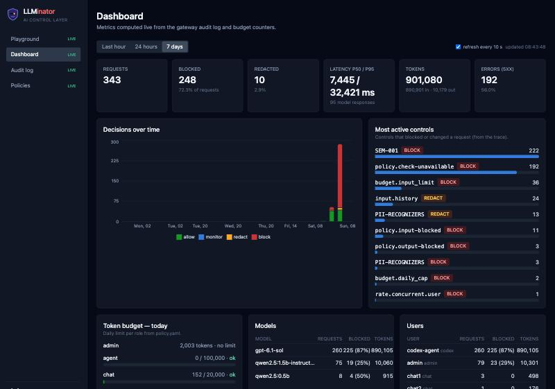
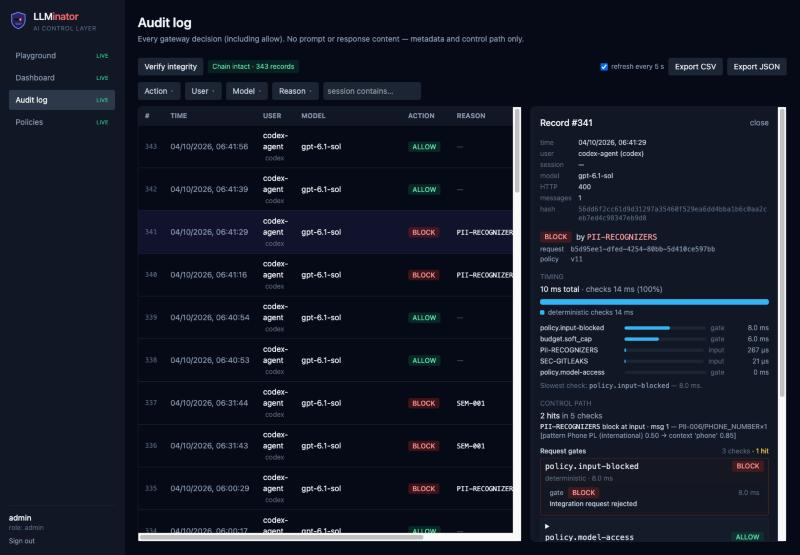
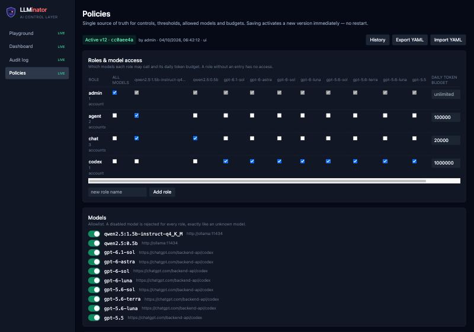
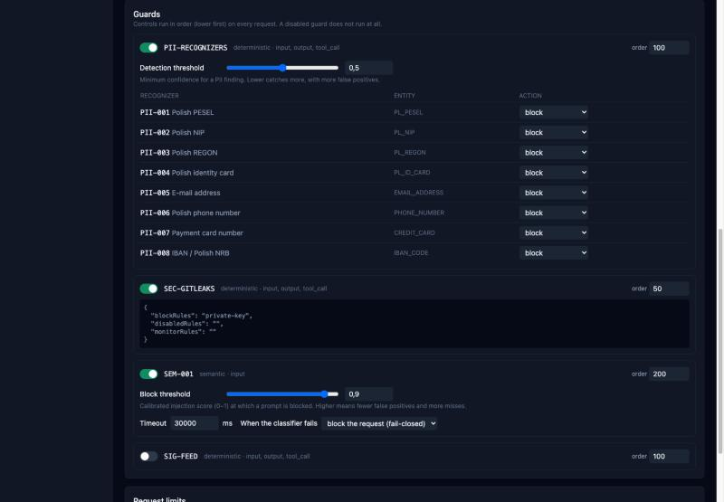

# 3. Reporting

Screenshots below are from the live deployment, taken during this write-up (not mocked data) —
[https://llminator.fmroz.me](https://llminator.fmroz.me), 7-day window, 343 real requests.

## Dashboard

Headline numbers, a decisions-over-time chart (allow/monitor/redact/block), and the most active
controls ranked by hit count — in this window `SEM-001` (222 blocks) and `PII-RECOGNIZERS` are the
top two, with per-role/per-model/per-user breakdowns below the fold.

## Audit log + Explainable Verdict ("Security X-ray")

- **"Verify integrity"** walks the full HMAC-SHA256 hash chain and reports `Chain intact · N
  records` (or exactly where it breaks) — one click, no raw content ever stored to check it.
- Selecting a record expands its **full control path**: every gate/guard that ran, its verdict,
  latency, and (for PII/secrets) the matched rule/recognizer and confidence — without ever
  exposing the actual sensitive value that triggered it.

## Live policy / guard configuration

Editing a threshold, a role's model access, or disabling a single PII recognizer here takes
effect on the **next request**, no redeploy — versioned (`v12 · cc0aee4a`, author, timestamp),
with history and rollback.

## Metrics implemented

Computed live from `audit_event` + `budget_counter` (`GET /api/dashboard`, windows: 1h/24h/7d):

- **Totals**: request count, breakdown by action (`allow`/`monitor`/`redact`/`block`), 5xx error count.
- **Latency**: p50 / p95 / max, over requests that actually reached the model (decisions with ~0ms don't skew it).
- **Tokens**: prompt + completion, summed.
- **Timeline**: bucketed decisions over time, stacked by action (the chart above).
- **Most active controls**: per guard/policy-id hit counts, split by action (what's actually firing in production).
- **Per-model stats**: requests, blocked count, tokens — one row per model tag.
- **Per-user stats**: requests, blocked count, tokens — one row per principal/role.
- **Token budget per role**: used / reserved / daily cap (or "unlimited"), live progress bar, "near limit" warning.
- **Per-request Explainable Verdict**: full control path with per-check latency, confidence/threshold signal where applicable, and which gate/guard decided — this is the case-by-case counterpart to the aggregate dashboard above.
- **Audit chain integrity**: tamper-evidence check, on demand.
- Export: CSV and JSON, same no-raw-content rule as the UI.
