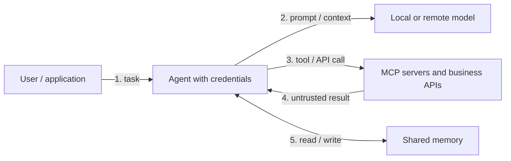
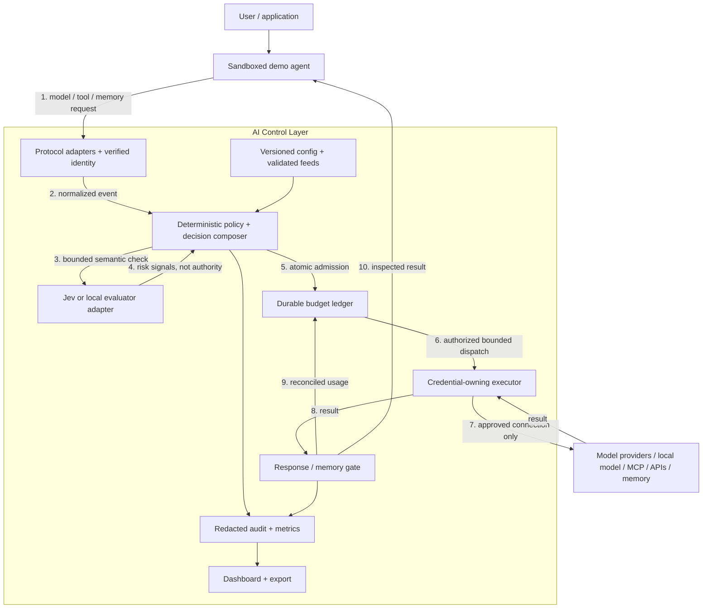

# AI Control Layer — competitive research and hackathon proposal

**Research date:** 2026-10-03 · **Status:** recommendation, not an implemented or benchmarked system.

The repository's primary challenge source, authoritative over this proposal, is
[`CRITERIA AI Control Layer.pdf`](../../project-spec/CRITERIA%20AI%20Control%20Layer.pdf).
Based on that four-page [hackathon brief](sources.md#b0), this package contains:
- **This report:** market landscape, recommendation, architecture, trade-offs, and demo plan.
- **[Requirements](requirements.md):** prioritized, testable requirements and acceptance scenarios.
- **[Jev assessment](jev-assessment.md):** capabilities, important security limitations, integration design, thresholds, cost, and evaluation plan.
- **[Sources](sources.md):** primary-source links, evidence notes, and research limitations.

## 1. Introduction and recommendation

The challenge is an **AI/agent security gateway plus resource-governance layer**, not simply a chatbot moderation filter. Its defining feature should be control over what agents are permitted to **do**, including through MCP and ordinary APIs, rather than only what they are permitted to **say**.

**Recommended approach:** build a small, locally runnable enforcement layer with a centralized, versioned policy file; deterministic identity/tool/data/budget controls; a replaceable semantic-classifier adapter; and a dashboard that explains every decision. Use **Jev as an optional fast semantic risk assessor**, not as the authorization engine. Ship a real local semantic mode so the demonstration does not depend on paid API access.

**The most consequential finding:** TypeSafe's current Jev documentation explicitly says adversarial input can influence its classification and that input state is not treated as hostile by default. Therefore, the claim that Jev returns type-safe outputs must not be interpreted as “Jev cannot be prompt-injected.” Keep hard boundaries outside the model. [J05](sources.md#j05)

### Suggested product pitch

> An auditable action firewall for AI agents: one live policy controls identities, data flows, tools, models, and spending. Deterministic controls enforce hard limits; semantic models flag suspicious intent; uncertainty never silently grants privilege.

This positioning combines features documented across existing products. **It is not a claim of market novelty.** The hackathon differentiator should be demonstrable correctness: a denied action never reaches its tool, concurrent calls cannot evade the configured admission budget, and judges can change policy and see the result immediately.

## 2. The problem and what the brief actually requires

### Current state

No existing implementation, team size, deployment stack, traffic measurements, or available Jev credentials were supplied. This is a greenfield proposal. The current-state diagram in Appendix C is a threat-model baseline, not a description of an inspected production system.

The brief identifies identity abuse, injection, data leakage, memory access, runaway resource consumption, and historical infrastructure exploits. It explicitly requires a **hybrid deterministic + semantic architecture**. Judges can submit unprepared prompts and modify policies/feeds live. A curated screenshot demo is insufficient. [B0](sources.md#b0)

### Required deliverables and evaluation weighting

| Deliverable / criterion | What must be demonstrable |
|---|---|
| Functional control layer and architecture diagram | Real interception of model traffic and agent actions; clear supported integration surfaces |
| Documented sample configuration | Central controls, model allowlists, thresholds, strictness modes, and resource/budget rules |
| Interactive dashboard | Active controls, posture/coverage, blocked threats, resource/cost usage |
| Executable test suite | Allowed and denied/redacted cases, including budgets and exploit mitigation |
| Robustness — **30%** | Enforce before side effects; cover evasions, bypass, and dependency failures |
| Architecture/performance — **20%** | Small integration surface; attributable latency; clear trust boundaries |
| Reporting — **20%** | Useful management view and exportable investigation evidence |
| Testing — **15%** | Repeatable tests, negative and benign cases, concurrency and failure tests |
| Implementability/scalability — **15%** | Reproducible local setup, replaceable components, explicit scale limitations |

No paid subscriptions, proprietary datasets, or hardware are provided. Paid services are not forbidden; depending on them without a runnable alternative is risky. [B0](sources.md#b0)

## 3. Comparable companies and products

These are **documented capabilities**, not head-to-head benchmark results. “Gap to verify” means the reviewed evidence did not establish that requirement; it does **not** mean the product lacks it. Commercial pricing and feature entitlements require confirmation.

### 3.1 Closest agent-security and runtime-security products

| Company / product | Documented overlap with the task | What to learn from it | Gap or caution for this hackathon |
|---|---|---|---|
| **Zenity** | Agent hooks and MCP gateway; contextual execution-path inspection; deterministic permissions; block/modify tool calls before execution | Separate hard boundaries from behavior/intent detection; inspect chains, not isolated strings | Validate exact integration coverage and commercial access; local compute accounting was not established [V01](sources.md#v01) |
| **Noma Security** | Agent/MCP/skill inventory and approval registry; user- and tool-scoped policies; runtime behavior control | Bind agent privileges to the human and task; treat tool approval as lifecycle state | A discovery registry is broader than an MVP; verify inline enforcement and budget behavior on the actual stack [V02](sources.md#v02) |
| **Lasso Security** | Agentic risk management, DLP, intent-aware policies, MCP inspection; MIT-licensed plugin gateway | A plugin architecture is a useful starting point for deterministic + semantic checks | Commercial Lasso detector plugin needs an API key; the OSS gateway is not the entire commercial platform [V03](sources.md#v03) |
| **Snyk / Invariant** | Contextual policies over messages and tool sequences; LLM/MCP proxy integration; local rule evaluation | Strong reference for rules such as “untrusted web content must not cause external email containing private data” | Verify current maintenance/integration compatibility; add durable budgets and reporting rather than assuming they are included [V04](sources.md#v04) |
| **Check Point AI Guardrails / Lakera** | Screening of prompts, outputs, tool descriptions/results/calls, leakage, and actions outside the trusted mandate; policy configuration | Clean detector API, role-aware inspection, regional processing controls | Calling an inspection API is not enforcement; the application still must stop execution. Not a complete local resource governor [V05](sources.md#v05) |
| **Cisco AI Defense** | Runtime inspection, gateway deployment, policy/management APIs; broader agent/MCP protection | Separate data-plane inspection from control-plane administration | The Inspection API explicitly leaves allow/block execution to the application; verify broader features separately [V06](sources.md#v06) |
| **Palo Alto Networks / Prisma AIRS**, including **Portkey** and **Protect AI** capabilities | Runtime traffic protection, pre-deployment model security, and AI gateway routing/guardrails/governance | Closest broad platform reference: runtime security + model supply chain + gateway operations are distinct components | Do not count Portkey as an independent competitor; do not assume every announced integration or enterprise feature ships in the MIT gateway [V07](sources.md#v07), [V08](sources.md#v08) |
| **SentinelOne / Prompt Security** | AI usage and agent/MCP discovery, least-privilege controls, inline data protection, action audit logs | Endpoint/employee coverage explains how an organization prevents agents bypassing a gateway | Endpoint-wide governance exceeds this demo; narrow claims to traffic actually intercepted [V09](sources.md#v09) |
| **CrowdStrike / Pangea AI Guard** | Configurable prompt/output/agent-plan inspection recipes and an MCP proxy integration | Different inspection policies at different lifecycle boundaries | Service-backed inspection is not the same as an offline gateway; budget guarantees were not established [V12](sources.md#v12) |

**Closest design references:** Invariant for trace-aware policies; Zenity/Noma for action authorization; Lasso for a small MCP plugin proxy; Prisma AIRS/Portkey for the broader control-plane vision.

### 3.2 Gateways and components worth building around

| Company / project | Strongest relevant capabilities | Important implementation finding |
|---|---|---|
| **BerriAI / LiteLLM** | Multi-provider proxy, policy-scoped guardrails, key/team/user budgets, cost reporting, pre-call reservations | Current docs say budgets need a DB and DB-less global enforcement can fail open. Reservations and fail-closed settings need testing, particularly unpriced routes, batch calls, and cache/store failure. MIT core; enterprise code has a separate license [V10](sources.md#v10) |
| **Maxim / Bifrost** | Virtual keys, provider/model access, hierarchical budgets, rate limits, governance UI/API | Virtual-key governance is optional unless made mandatory. Reviewed docs do not establish strict concurrency-safe pre-reservation. Apache-2.0 core; verify enterprise boundaries for the exact release [V11](sources.md#v11) |
| **agentgateway** — open-source project | JWT/CEL MCP authorization, filtered tool discovery plus call-time denial, LLM cost controls | Its documented budgets charge after the response; the request crossing the limit completes. Missing usage may go uncharged. Reuse transport/auth ideas, not this behavior as a hard-spend guarantee [V13](sources.md#v13) |
| **TypeSafe / Jev** | Typed probabilistic questions for contextual classification, low advertised latency and input cost | A semantic component, **not a security platform**. Adversarial vulnerability, model drift, data egress, and failure handling remain your responsibility [J01](sources.md#j01), [J05](sources.md#j05) |

**Market conclusion:** many providers already combine some of these capabilities. The opportunity in this task is not another generic “AI guardrail” label; it is a coherent, testable integration of enforcement, local/remote resource budgets, live policy, and evidence.

### 3.3 Open-source reuse and licensing

| Candidate | Verified license / caveat | Recommended use |
|---|---|---|
| Lasso MCP Gateway | MIT; commercial detector separate | Candidate transport/plugin substrate if it fits the demo agent |
| Invariant Guardrails | Apache-2.0 | Candidate trace-policy library or design reference |
| LiteLLM | MIT outside separately licensed enterprise directory | Optional provider adapter; do not import enterprise features unknowingly |
| Bifrost | Apache-2.0 core; commercial feature boundaries need review | Alternative integrated gateway, not an additional mandatory component |
| Portkey gateway | MIT | Alternative routing/guardrail substrate; hosted governance is a separate evaluation |
| agentgateway | Apache-2.0 | Alternative MCP/LLM data plane; supplement strict budget accounting |
| Microsoft Presidio | MIT | PII recognizers plus custom secret patterns; validate language/domain coverage |
| ModelScan | Apache-2.0 | Optional artifact scanner, after maintenance/format review |

Sources: [V03–V04](sources.md#v03), [V08](sources.md#v08), [V10–V13](sources.md#v10), [O01–O02](sources.md#o01).

Do **not** automatically adopt an old detector because a tutorial recommends it. The current Protect AI DeBERTa prompt-injection model card says the project and associated LLM Guard code are archived/unmaintained; it also disclaims non-English and jailbreak coverage. Use it only as a disclosed historical evaluation baseline. [O03](sources.md#o03)

Pin dependency versions/digests, preserve license notices, review transitive dependencies and model licenses, and avoid runtime downloads of unpinned packages. This is a supply-chain control in its own right.

## 4. Functional requirements and scope

The full [requirements catalog](requirements.md) distinguishes:
- **P0:** hackathon baseline, using deliberately narrow integrations.
- **P1:** higher-value stretch controls after the baseline works.
- **P2:** production expansion, not a demo claim.

### The minimum coherent slice

1. One sample agent, one local model route, one configured remote-model route, and one real MCP server exposing safe mock business tools.
2. Central policy with strict/standard/observe profiles, versioning, atomic reload, and last-known-good behavior.
3. Deterministic identity, tenant/resource, tool-argument, destination, secret/PII, and model-allowlist controls.
4. Real semantic inspection for inputs/tool outputs and proposed actions; Jev plus an offline adapter, with explicit degraded states.
5. Monetary admission reservations for priced APIs; local token/time/concurrency quotas; tool-call/depth limits.
6. External attack-feed ingestion with two or three carefully scoped, safe historical fixtures.
7. A dashboard and redacted event export explaining allows, denials, redactions, errors, latency, and spending.
8. One-command tests and repeatable ad-hoc interaction.

**Non-goals:** universal endpoint protection; every provider API; a complete identity provider; a SIEM; an enterprise compliance certification; guaranteed prompt-injection prevention; GPU scheduler implementation; proving model artifacts harmless from filenames or text.

## 5. System requirements

These numbers are **proposed acceptance targets**, not requirements stated by the brief or measured performance. Record actual hardware, software versions, payload size, concurrency, and dependency latency. Revise targets explicitly if the actual hackathon setup cannot support them.

| Attribute | Proposed target and measurement |
|---|---|
| Deterministic fast path | Added gateway p95 <=20 ms at 20 requests/s, 20-client cap, 4 KiB payload, 10 minutes, stub upstream; measure at gateway ingress/egress |
| Jev path | At 5 inspections/s with approximately 6k metered input tokens each: report p50/p95/p99; aim for p95 <=1 s per inspection, total detector deadline 1.5 s including retries. These are targets, not a vendor SLA |
| Local semantic path | Publish the measured distribution on the demo machine; configure a finite deadline before demo. Never silently use the Jev target as a local-model promise |
| Policy reload | Valid update visible to new decisions in <=2 s; invalid update rejected without replacing last-known-good policy |
| Budget integrity | No admission when committed + reserved + bounded new cost exceeds the configured cap, across at least 50 simultaneous submissions; limit the claim to priced/bounded routes |
| Local limits | Enforce maximum input/output tokens, in-flight calls, elapsed task time, tool calls, and workflow depth. Report GPU-time controls only if actually instrumented/enforced |
| Audit/reporting | One redacted outcome per intercepted decision, stable correlation IDs, policy/model/feed versions; dashboard freshness <=2 s |
| Failure behavior | Mandatory control failure yields deny or hold before effects; missing prices and unknown usage never become “free” |
| Restart | Durable policy/ledger/audit survive a process restart; unresolved dispatched reservations remain held pending reconciliation |
| Setup | Once documented dependencies/model weights are preinstalled, start with one command and run the offline suite with one command; no paid account required for the offline path |

**Capacity:** the highest-cost step is normally semantic inspection, not simple policy evaluation. At Jev's documented 80 requests/s and 100k input tokens/s, two 6k-token inspections per protected action imply a quota ceiling of `min(80/2, 100000/(2×6000)) ≈ 8.3 actions/s`, before any other account traffic. A 5-inspection/s test is below that ceiling. Queue capacity and backpressure must be explicit. These are quota calculations, not achieved throughput. [J02](sources.md#j02)

**Availability:** no production SLA is proposed without deployment and load information. For the single-node demo, target operator restart/recovery within five minutes; persisted policy/ledger should lose no acknowledged transaction, but disk loss is outside that guarantee. P2 requires replication, backup/restore tests, and owner-approved RPO/RTO.

## 6. Proposed architecture

Appendix D shows the target architecture. Use a **shared decision core with thin protocol adapters** rather than different policy implementations for LLM, MCP, and ordinary API calls.

### 6.1 Components and ownership

| Component | Responsibility and owned state |
|---|---|
| Protocol adapters | Normalize an explicitly supported LLM API subset, MCP operations, and registered HTTP tools; preserve protocol errors, cancellation, and request identity |
| Identity/context builder | Derive tenant, user, agent, delegated scopes, task ID, and trusted user mandate from authenticated application state; never trust model-supplied identity claims |
| Policy engine | Load schema-validated versioned policy; resolve profiles; apply deterministic rules; compose semantic signals into final actions |
| Semantic adapter | Jev or local evaluator behind the same internal result contract; owns no authorization authority, credentials, or tools |
| Budget ledger | Atomic reserve/commit/reconcile for money and counters; owns durable accounting and unresolved dispatched holds |
| Connector executor | Sole holder of upstream credentials; only component allowed to invoke approved tools/providers; rechecks decision binding before execution |
| Response/memory gate | Inspect outputs before release or memory write; enforce tenant/resource boundaries independently of textual filters |
| Feed loader | Validate and activate versioned rule bundles with provenance/expiry; no arbitrary code execution from feeds |
| Audit/dashboard | Redacted decision events, metrics, policy status, detector health, feed freshness, spend and reservation views |

A practical hackathon implementation is a Python service with an official, pinned MCP SDK, a small HTTP adapter, a typed config schema, and a transactional SQLite ledger for **one node**. This is a recommendation, not a dependency on Python. A multi-replica deployment needs shared transactional admission state; do not copy the SQLite counters into each worker and claim distributed correctness.

### 6.2 Enforcement flow

1. **Authenticate and normalize.** Bound size/decompression/depth, reject unsupported payloads, assign trusted provenance, and resolve a policy version.
2. **Run inexpensive hard checks.** Tenant/resource access, model/tool allowlists, strict argument schema, destination restrictions, secrets, and signature rules. A hard denial cannot be overridden by Jev.
3. **Prepare safe semantic state.** Keep provenance, trusted task, proposed action, and relevant untrusted content. Minimize/redact secrets before sending anything to a remote classifier. If redaction removes crucial evidence, inspect locally or hold.
4. **Reserve detector resources and inspect.** Apply a deadline and bounded retries. Independently classify injection, task mismatch, leakage intent, and suspicious action consequences.
5. **Compose the decision in code.** Return `ALLOW`, `BLOCK`, `REDACT`, or `REQUIRE_APPROVAL`; record degraded/unknown states explicitly. P0 may block actions needing approval; a full approval workflow is P1.
6. **Reserve execution resources atomically.** Enforce all applicable caps before provider/tool dispatch. Unknown/unbounded billing routes are unsupported for hard-cap mode.
7. **Execute exactly the authorized action.** Bind identity, tool/server version, normalized arguments, policy, expiry, and one-time execution ID. Revalidate if action or authorization changes.
8. **Inspect and release the result.** Buffer bounded outputs for the MVP; scan before returning to the agent/user or writing memory. Commit actual usage; retain conservative holds if billing status is unknown. Append redacted audit evidence.

**Important:** scanning a tool's output cannot undo a payment, deletion, or email that already happened. Pre-execution authorization is mandatory for side effects.

### 6.3 Trust boundaries and bypass prevention

- Provider/API credentials stay in the executor, not in the agent's environment or prompts.
- The demo agent runs in a network/filesystem boundary that denies direct provider/tool access; only the gateway can reach approved backends. An SDK wrapper without this boundary is cooperative instrumentation, not non-bypassable security.
- Ordinary HTTP tools target a configured registry, not an arbitrary user-supplied proxy destination. Resolve and validate host/IP/redirects; deny metadata/internal endpoints except explicitly approved services.
- Tool output, retrieved documents, memory content, tool descriptions, and agent-to-agent messages remain lower-trust data. A trusted transport or valid schema does not make their instructions trustworthy.
- Use the negotiated/pinned MCP revision. Application workflow IDs are not authentication and are not necessarily MCP protocol sessions. Current specification and legacy session-based versions differ. [S02](sources.md#s02), [S03](sources.md#s03)

### 6.4 Budget design: money and local resources

For priced token routes, reserve an upper bound before dispatch:

`reservation = input_token_bound × input_price + enforced_max_output_tokens × output_price + bounded_extra_fees`

All units, prices, tariff versions, window boundaries, retry attempts, and provider-specific billable tokens must be explicit. If a provider can charge uncapped hidden tokens or unknown fees, a mathematically strict spend claim is unavailable: deny that route in hard-cap mode or disclose a separate bounded-overrun mode. Use integer money units or exact decimal arithmetic.

Admission requires `committed + active_reservations + new_reservation <= limit` for **every applicable scope**. Release unused reservation after reconciled completion. Never release a dispatched request's hold just because a client disconnected or a lease expired: the provider may still be billing.

Local models may have zero API invoices but consume finite capacity. Enforce tokens, concurrent generations, queue length, deadlines, workflow/tool counts, and worker limits. Request wall time is not GPU time; a canceled HTTP connection is not proof that inference stopped. Where hard resource termination is required, use a controllable worker/sandbox or explicitly state the serving system's limitation.

Also account for guardrail calls. Attack traffic must not cause unbounded Jev spending or recursive inspection of the detector's own requests.

### 6.5 Failure and operational behavior

| Failure | Required response |
|---|---|
| Invalid live policy / bad feed | Keep last-known-good validated state; reject update; emit visible error. If no valid state exists, remain unready |
| Jev/local detector timeout, malformed response, overload | Mandatory semantic gate holds/denies; never convert error into a clean score. Optional low-risk degraded behavior must be explicit and audited |
| Ledger unavailable | Deny metered/high-impact work before dispatch |
| Provider timeout / client cancellation | Attempt cancellation; preserve uncertain billing hold; reconcile; do not automatically retry non-idempotent tools |
| Tool definition changes | Quarantine changed definition or require reapproval; invalidate relevant cached decisions |
| Audit persistence unavailable | Fail closed for mutating/metered actions if an intent record cannot be durably written; surface degraded status |
| Emergency revocation | Recheck before side effects, even if an earlier policy snapshot permitted the request |

Expose counters, latency histograms, detector errors, budget holds, policy reload errors, and stale-feed age. Proposed alerts: any ledger write failure or policy integrity failure; stale feed beyond configured expiry; semantic errors above 5% over five minutes with at least 20 calls. Send to the dashboard/operator in the demo; production SOC/on-call routing and ownership are **TBD before deployment**.

Store no raw prompt/tool bodies by default. Proposed demo retention: redacted events for 24 hours, then deletion; override only with an explicit investigation policy. Production retention, residency, and applicable privacy obligations depend on the organization and jurisdiction. OWASP mapping is not GDPR, EU AI Act, SOC 2, or ISO compliance certification.

## 7. Historical attacks: meaningful coverage, not theatrical signatures

| Historical example | Control-layer mitigation to demonstrate | What must happen outside a text filter |
|---|---|---|
| **Langflow CVE-2025-3248**, unauthenticated code validation RCE | Registry-aware rule blocks untrusted access to the vulnerable service/route; mock request never reaches executor; reload a feed rule live | Patch to a currently supported version and isolate administrative/code-execution endpoints. Historical fix was 1.3.0, not a current recommended deployment [H01](sources.md#h01) |
| **PyTorch CVE-2025-32434**, unsafe model loading even with `weights_only=True` on affected versions | Deny admission of an unapproved model artifact or vulnerable loader version; verify digest/provenance policy | Patch runtime, scan/quarantine artifacts, prefer constrained formats where suitable, isolate loading. A prompt classifier cannot inspect arbitrary pickle semantics [H02](sources.md#h02) |
| **Ray / ShadowRay** | Deny unauthorized job submissions and direct access to protected management services; audit attempts | Network isolation and authenticated access to job infrastructure. Vendor frames the issue as a trust-boundary/deployment problem [H03](sources.md#h03) |
| **MCP tool poisoning / cross-tool exfiltration** | Inspect metadata and results; detect definition drift; block private-data-to-external-destination flow even if each tool is individually allowed | Least privilege, separate credentials/trust domains, approved destinations, action confirmation [H04](sources.md#h04), [S02](sources.md#s02) |

Use inert local fixtures and mock tools, not live exploit payloads against vulnerable internet systems. A feed should identify asset/version/route, conditions, action, provenance, expiry, and test fixtures. CVE identifiers or a vulnerability catalog are **not automatically executable detection signatures**. Production feeds need a trusted distribution/update mechanism; custom bundles can be signed, but do not imply an upstream feed provides signatures it does not actually publish.

## Appendix A — skeptical FAQ

**Why not just ask Jev “is this tool call safe?”**
Because safety combines independently checkable permissions, exact arithmetic, context, and adversarial interpretation. Jev itself documents adversarial and numeric limitations. Ask narrow semantic questions and enforce the final policy in code.

**Can this guarantee absence of prompt injection?**
No. It can reduce exposure and, more importantly, prevent selected harmful effects even when a detector misses an attack. Report false positives/negatives and actual action outcomes separately.

**Why not use LiteLLM alone?**
It is a strong provider-gateway candidate. The task also needs action-level MCP/API enforcement, local resource limits, live exploit feeds, and tests proving the specific guarantees. Add only the missing pieces; do not rebuild provider routing for its own sake.

**Can a gateway prevent malicious model deserialization?**
Only if model admission/loading is in its governed path. Otherwise artifact scanning, loader patching, sandboxing, and deployment controls are separate requirements. Say what is out of scope.

**What if Jev access is unavailable?**
Use a real local semantic evaluator with the same interface, its own calibrated thresholds, and visible model/latency information. Unit-test stubs are acceptable test doubles, not a substitute for the live semantic demo.

**What is the hardest unresolved edge case?**
A long, mostly benign tool result causes a task-plausible external action carrying sensitive information indirectly. Exact-string DLP may miss transformations, while semantic inspection may be manipulated. Constrain destinations and action authority, propagate provenance conservatively, and test this chain explicitly.

**What is the rollback plan?**
Restore a signed/versioned known-good policy or detector version; preserve the budget ledger and audit history. Do not “rollback” by routing around the gateway. Already-executed side effects are the point of no return and may require compensating actions.

## Appendix B — considered implementation options

| Dimension | Baseline: prompt filter only | Extend existing AI gateway | Narrow custom core + adapters — recommended | Enterprise platform |
|---|---|---|---|---|
| Brief coverage | Poor: misses actions, budgets, feeds | Good starting point; gaps depend on product/version | Exact scoped coverage under team control | Broad documented capability, entitlement/integration dependent |
| Main advantage | Fast prototype | Existing routing and operations | Clear semantics, demo focus, easy live policy experiments | Enterprise discovery/integration breadth |
| Main risk | False impression of security | Feature/license complexity; inherited failure defaults | Team must build/test protocol and ledger seams correctly | Access, commercial setup, and less control over judge-visible behavior |
| Jev integration | Easy but unsafe if sole authority | Custom hook/guardrail | First-class replaceable detector adapter | Depends on product integration support |
| Offline demo | Possible | Possible with selected OSS features | Required by design | Must be confirmed |
| Decision | Reject as insufficient | Preferred fallback if existing team expertise saves time | Select for a tightly scoped greenfield demo | Research reference, not a dependency without access |

Do not assemble every named gateway. Select **one** data plane; reuse an existing project only if its verified capabilities shorten the path to the required tests.

## Appendix C — illustrative uncontrolled baseline

Relationships 2–5 have no common, demonstrated policy or accounting boundary. This is a conceptual baseline, not an observed installation.

## Appendix D — proposed enforcement boundary

The semantic adapter may cross a separate external-provider trust boundary when using Jev. Direct agent-to-backend paths are denied. A policy snapshot binds each decision, while emergency revocation is checked again immediately before effects.

## Appendix E — delivery, validation, and rollout plan

The hackathon duration, team members, and event date were not supplied. These are **uncommitted phases**, not a schedule. Calendar dates and named owners are **TBD by the team before implementation**; exit criteria establish order.

| Phase | Proposed role owner | Scope / exit condition | Dependency |
|---|---|---|---|
| 1. Enforcement skeleton | Gateway owner | Agent can use one real MCP server and one model route only through gateway; unauthorized call does not execute | Chosen SDK/protocol and demo environment |
| 2. Deterministic core | Policy/budget owner | Live config; identity/data/tool controls; concurrent reservations; local limits; restart test | Phase 1 |
| 3. Semantic controls | Evaluation owner | Jev/local adapters; uncertainty/error paths; held-out tests; detector-version logging | Phase 2; access/model readiness |
| 4. Evidence and attacks | Reporting/test owner | Dashboard, JSONL export, historical fixtures, feed update, complete allowed/blocked suite | Phases 2–3 |
| 5. Adversarial rehearsal | Whole team | Fresh-machine/offline run; spontaneous prompts; live config edit; latency report; known limitations visible | Phase 4 |

Roles may be combined on a small team. If time is short, defer discovery, sophisticated approval workflows, full tracing UI, multimodal coverage, and multiple protocol/provider integrations—not the required dashboard, local limits, or negative tests.

**Future rollout:** shadow evaluation only on synthetic/read-only traffic → block obvious deterministic violations → enable semantic gating for scoped users/tools after evaluation → widen scope. Never use shadow mode to bypass an existing mandatory access rule. Abort on unauthorized side effects, lost accounting, or unacceptable benign-block rate. Roll back policy/model versions without discarding ledger state.

### Suggested judge walkthrough

1. A benign request succeeds through the model and one tool.
2. An unauthorized tool/action is denied before execution, despite benign wording.
3. An indirect injection in a document is flagged; an attempted exfiltration is independently denied by destination/data policy.
4. PII is redacted from an allowed response; a secret never reaches the remote classifier or logs.
5. Parallel requests exhaust the budget without over-admission; a local loop hits its tool/time limit.
6. A judge edits thresholds or a model allowlist; the next decision shows the new policy version.
7. A historical attack fixture is blocked by a live-updated feed; a malformed update leaves the valid policy intact.
8. Disable Jev or the budget store: the dashboard shows the fault and protected actions do not silently proceed.
9. Run the automated suite and export the corresponding audit events.

**Decision to make first:** which single agent/MCP integration to demonstrate, whether Jev credentials are available, and which local semantic model the actual machine can run. None of these should change the security contract.
